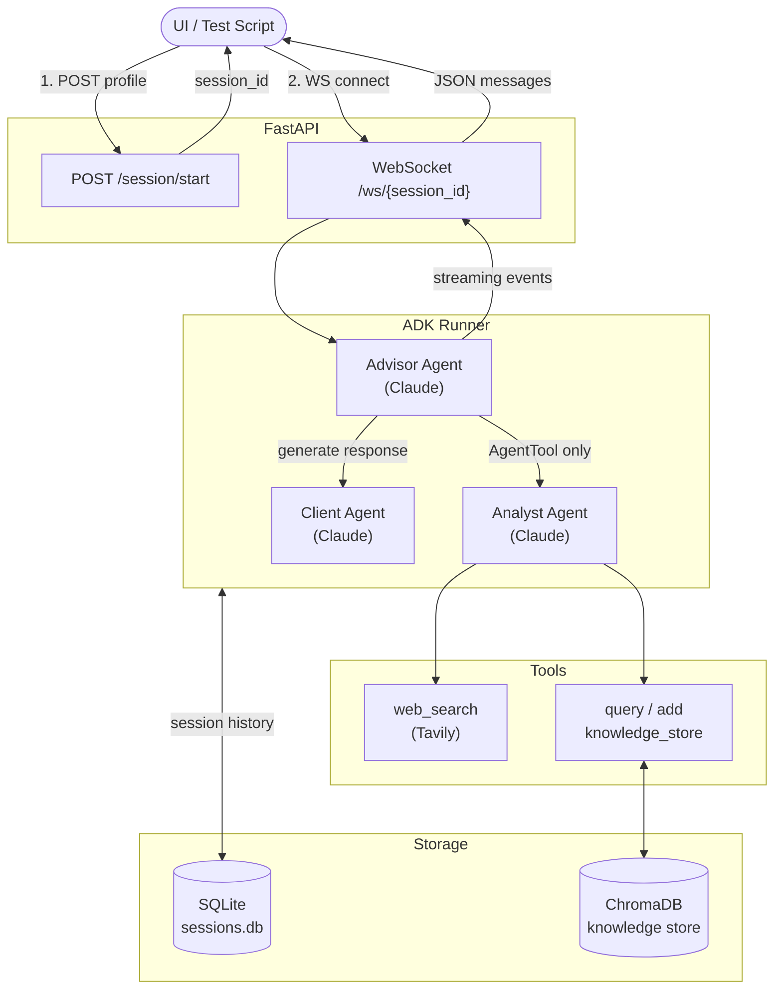
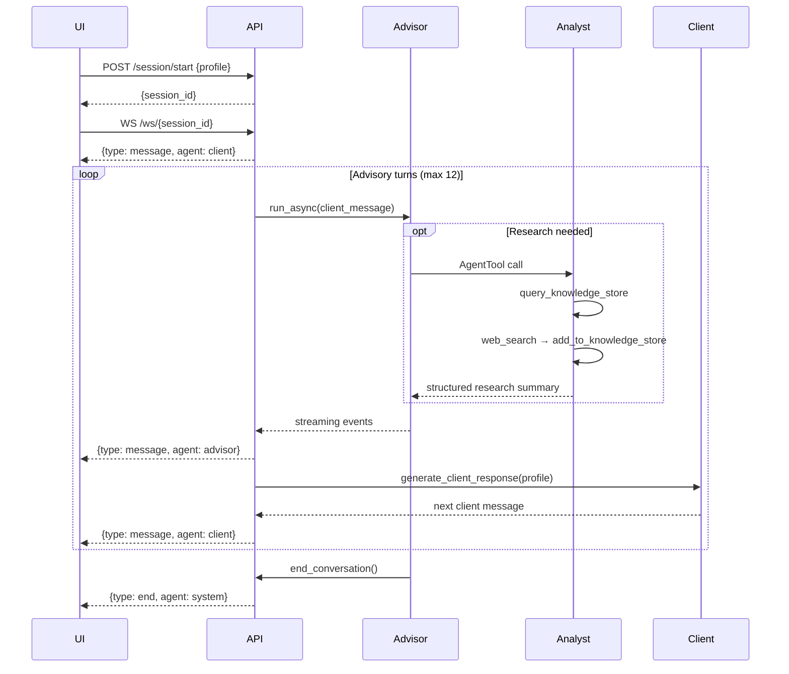

# Multi-Agent Investment Advisory System

A multi-agent conversational system where three AI agents collaborate to deliver a personalised investment recommendation to a simulated client.

Built with **Google ADK**, **Anthropic Claude**, **FastAPI WebSockets**, **ChromaDB**, and **SQLite**.

---

## Architecture



> **Key constraint:** Analyst is registered as an `AgentTool` on Advisor only. Client has no reference to Analyst — the communication boundary is enforced architecturally, not by convention.

---

## Conversation Flow



---

## Agents

| Agent | Role | Tools | Talks to |
|---|---|---|---|
| **Advisor** | Orchestrates the session, produces the recommendation | `AgentTool(analyst)`, `end_conversation` | Client, Analyst |
| **Analyst** | Researches market data and investment strategies | `web_search`, `query_knowledge_store`, `add_to_knowledge_store` | — (never talks to Client) |
| **Client** | Simulates the investor using the supplied profile | None | Advisor only |

---

## WebSocket Message Protocol

Every message sent over the WebSocket is a JSON object:

| `type` | `agent` | Meaning |
|---|---|---|
| `message` | `client` | Simulated client speaking |
| `message` | `advisor` | Advisor responding to client |
| `status` | `advisor` | Advisor delegating to a tool (e.g. "Calling analyst…") |
| `status` | `analyst` | Analyst using a tool |
| `end` | `system` | Session complete, connection will close |
| `error` | `system` | Session not found or fatal error |

---

## API Reference

### `POST /session/start`

Create a new advisory session with a client profile. Returns a `session_id` to use with the WebSocket.

**Request body:**
```json
{
  "profile": {
    "name": "Sarah Kim",
    "age": 28,
    "risk_tolerance": "aggressive",
    "annual_income": 80000,
    "assets": {
      "retirement_401k": 15000,
      "brokerage": 10000,
      "cash": 20000
    },
    "current_holdings": [
      { "symbol": "AAPL", "shares": 10, "avg_cost": 170.0 }
    ],
    "goal": "grow wealth aggressively over 30 years",
    "concerns": ["inflation", "missing out on growth"]
  }
}
```

`risk_tolerance` must be one of: `"conservative"`, `"moderate"`, `"aggressive"`

**Response:**
```json
{ "session_id": "c1680588-4764-47f0-9e3c-e754e3109385" }
```

---

### `WebSocket /ws/{session_id}`

Connect after calling `/session/start`. The server immediately begins streaming the advisory conversation. No client messages are expected — the session is fully autonomous.

**Example stream:**
```json
{"type": "message", "agent": "client",  "content": "Hi, I'm Sarah Kim..."}
{"type": "message", "agent": "advisor", "content": "Hello Sarah! Let me understand your situation..."}
{"type": "status",  "agent": "advisor", "content": "Calling analyst…"}
{"type": "status",  "agent": "analyst", "content": "Calling web search…"}
{"type": "message", "agent": "advisor", "content": "Based on current market data..."}
{"type": "message", "agent": "client",  "content": "That makes sense. What about inflation?"}
{"type": "end",     "agent": "system",  "content": "Advisory session complete."}
```

---

### `GET /health`

```json
{ "status": "ok" }
```

---

## Setup

### Prerequisites
- Python 3.11+
- [`uv`](https://docs.astral.sh/uv/)
- `ANTHROPIC_API_KEY` — [console.anthropic.com](https://console.anthropic.com)
- `TAVILY_API_KEY` — [tavily.com](https://tavily.com) (free tier works)

### Install

```bash
git clone <repo>
cd asset-agents

uv venv
uv sync --extra dev

cp .env.example .env
# Fill in both API keys in .env
```

### Run the server

```bash
uv run uvicorn api.main:app
```

### Run a full end-to-end conversation

```bash
uv run python watch_session.py
```

Edit the `PROFILE` dict in `watch_session.py` to test different investor scenarios.

### Run tests

```bash
# Fast tests (no API calls)
uv run pytest tests/test_api.py::test_health \
              tests/test_api.py::test_start_session_returns_session_id \
              tests/test_api.py::test_start_session_rejects_invalid_age \
              tests/test_api.py::test_websocket_rejects_unknown_session \
              tests/test_agents.py::test_knowledge_store_roundtrip \
              -v

# Full suite (requires API keys)
uv run pytest -v
```

---

## Project Structure

```
asset-agents/
├── agents/
│   ├── client_agent.py       # Simulated investor persona (profile-driven)
│   ├── advisor_agent.py      # Orchestrator with AgentTool(analyst)
│   └── analyst_agent.py      # Researcher with web + knowledge store tools
├── tools/
│   ├── web_search.py         # Tavily web search
│   └── knowledge_store.py    # ChromaDB read/write
├── api/
│   └── main.py               # FastAPI app, WebSocket handler, Pydantic models
├── data/
│   ├── sessions.db           # ADK session history (SQLite, auto-created)
│   └── chroma/               # ChromaDB collections (auto-created)
├── tests/
├── watch_session.py          # End-to-end test script
├── pyproject.toml
└── .env.example
```

---

## Design Decisions

**Why `AgentTool` for Analyst?**
The communication constraint (Analyst must not talk to Client) is enforced at the tool registry level. Analyst is only reachable as a tool on Advisor's tool list — Client has no reference to it at all. This is an architectural guarantee, not a convention that could be bypassed by a prompt.

**Why LiteLlm as the ADK–Claude bridge?**
ADK's `Runner`, `SessionService`, and event streaming are built around Google's infrastructure. `LiteLlm` lets us keep all of that while swapping the underlying model to Claude. The trade-off is one extra dependency layer; the swap path to Gemini is a single string change.

**Why SQLite for sessions?**
`DatabaseSessionService` with `aiosqlite` gives durable, inspectable session history with zero operational overhead. Upgrading to Postgres for multi-instance deployments is a one-line `db_url` change.

**Why ChromaDB for the knowledge store?**
Local, no external service, persists to disk, and sufficient for a demo. The Analyst populates it during the session so repeated questions reuse prior research instead of re-hitting the web.

**Why explicit `end_conversation()` tool?**
Parsing LLM output text to detect "done" is fragile. A tool call is a structured, unambiguous signal — the Advisor decides when to terminate and the event loop detects it reliably by checking `function_call.name`.

**Why fully simulated client?**
The assignment asks for a simulated client, but the profile is provided dynamically via `POST /session/start`. Any investor profile can be tested without changing code. In a real product, the Client Agent would be replaced by a real human chat interface — the Advisor and Analyst layers remain unchanged.
